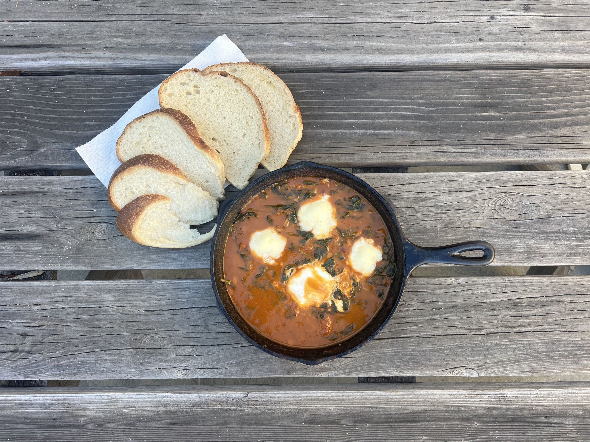
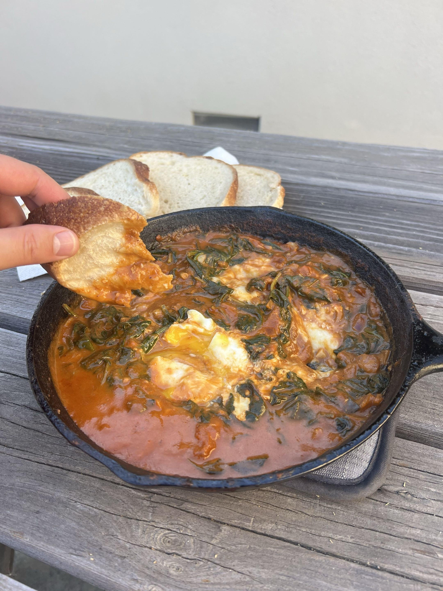

<RecipeCard>

## Photos

*Shakshuka*

*Shakshuka (Glamour Shot)*

## Ingredients
### Sauce
- 2 tablespoons olive oil
- 3 medium tomatoes halved, and/or 1 tablespoon tomato paste and/or 1 can (28oz) crushed tomatoes
- 1 medium yellow onion, diced
- 1 red bell pepper, diced
- 5 cloves garlic, minced
- 1 teaspoon cumin
- 1 teaspoon paprika
- 1/4 teaspoon cayenne pepper (adjust to taste)
- Salt and black pepper, to taste
- 3–6 large eggs
- Fresh parsley or cilantro, roughly chopped
- 1/2 teaspoon sugar (optional)
- 2 oz crumbled feta cheese (optional)
- Crusty bread or pita, for serving

## Instructions
1. Heat **olive oil** in a large, deep skillet or Dutch oven over medium heat.
2. Add the **onion** and **red bell pepper**. Cook, stirring occasionally, until softened and lightly golden, about 7–8 minutes.
3. Halve the **tomatoes** and place them face side down in the pan. Cook, covered for 7-8 minutes until the skin on the tomatoes can be removed by tongs.
4. Optionally, add the **tomato paste** and **crushed tomatoes** and cook for 1 minute.
5. Smash the skinless tomatoes down as much as they can go. Cook for another few minutes while they start to break down.
6. Add the **garlic**, **cumin**, **paprika**, **smoked paprika**, and **cayenne**. Stir and cook for 1–2 minutes until very fragrant.
7. Season with **salt**, **pepper**, and a pinch of **sugar** if desired. Stir to combine.
8. Reduce heat to medium-low and simmer uncovered for 10–15 minutes, stirring occasionally, until the sauce has thickened and the tomatoes have fully broken down.
9. Use the back of a spoon to make 5–6 wells in the sauce. Carefully crack an **egg** or put a pinch of **mozzarella cheese** into each well.
10. Cover the skillet and cook for 8–10 minutes, or until the egg whites are just set but the yolks are still runny. Check frequently — they go from underdone to overdone quickly.
11. Remove from heat. Scatter **feta** (if using) and **fresh herbs** over the top.
12. Serve directly from the pan with plenty of **crusty bread or pita** for scooping.

## Notes
### Egg Doneness
- For runny yolks, cover and cook 7–8 minutes. For fully set yolks, cook 10–12 minutes. Start checking early — residual heat will continue cooking the eggs after you remove the lid.

### Make It Ahead
- Instead of the tomatoes/paste, tomato sauce can be made up to 5 days in advance and stored in the fridge. Reheat in the skillet and add the eggs fresh to order.

### Variations
- **Green shakshuka**: swap tomatoes for tomatillos and add spinach or chard.
- **Spicier**: add a finely chopped jalapeño or a pinch of red pepper flakes with the onion.
- Add a can of drained chickpeas to the sauce for extra protein.

## References
- Reference Recipe **[HERE](https://downshiftology.com/recipes/shakshuka/)**
</RecipeCard>
