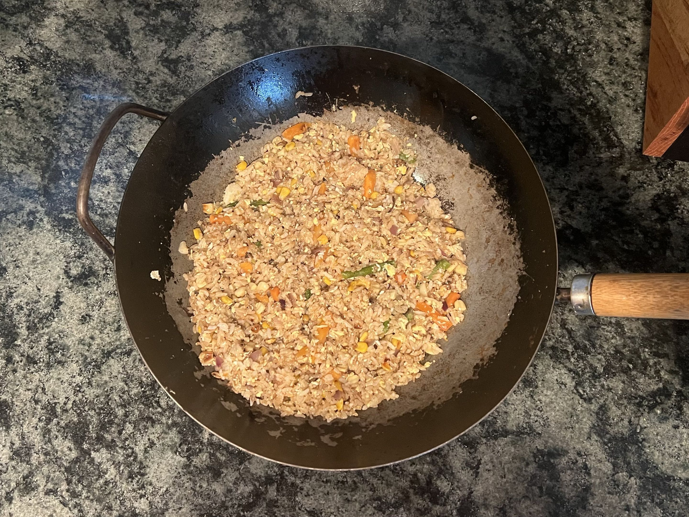

<RecipeCard>

## Photos

*Fried Rice*

## Ingredients
- 3 cups cooked long-grain white rice, day-old or cooled (about 1 cup dry)
- 3 tablespoons neutral oil
- 3 large eggs, beaten
- 1 cup frozen peas and carrots, or other vegetables
- 4 green onions, thinly 
- 4 cloves garlic, minced
- 2 tablespoons soy sauce
- 1 tablespoon oyster sauce
- 1 teaspoon sesame oil
- Salt and white pepper, to taste

## Instructions
1. Break up the **cold rice** with your hands or a fork so there are no large clumps.
2. Heat a wok or large skillet over high heat until very hot. Add 1 tablespoon **oil** and swirl to coat.
3. Add your vegetables to the wok and stir fry for 1-2 minutes until heated through. 
4. Add another teaspoon of **oil** and add the **rice** to the wok. Let it sit to develop color and texture. Then stir fry, tossing everything together.
5. Drizzle with **soy sauce** and **oyster sauce** and toss to coat evenly.
6. Clear a center in the middle of the rice, and put the rest of the oil in. Add your beaten **eggs** and cook them completely through.
7. Fold the eggs in and break up any larger pieces. Drizzle with **sesame oil**, season with **salt and white pepper**, and toss once more.
8. Garnish with the rest of the **green onions** and serve immediately.

## Notes
### Day-Old Rice
- Freshly cooked rice has too much moisture and will steam instead of fry. Spread cooked rice on a sheet pan and refrigerate uncovered overnight for best results.

### High Heat
- A screaming hot wok is essential. Cook in batches if your burner isn't very powerful — crowding the pan drops the temperature and causes steaming.

### Customize
- Add diced chicken, shrimp, or tofu in step 4 before the vegetables.
- A splash of rice wine or Shaoxing wine added with the soy sauce adds depth.
- Substitute frozen corn, edamame, or diced bell pepper for the peas and carrots.

## References
- Reference Recipe **[HERE](https://www.thekitchn.com/fried-rice-recipe-23652991)**
</RecipeCard>
