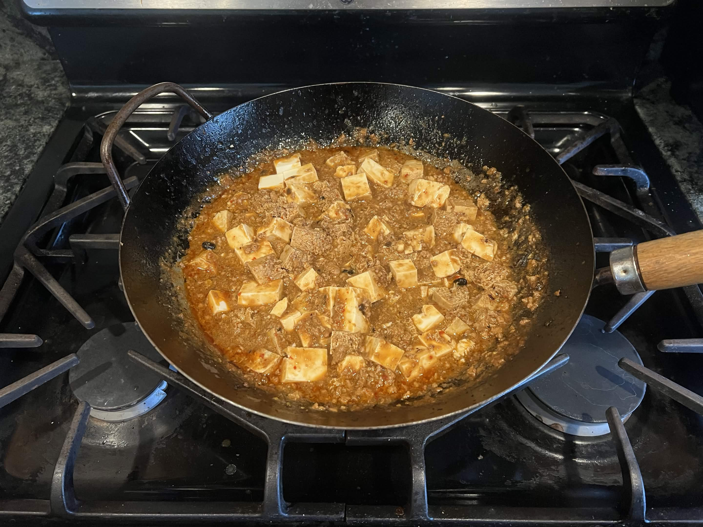

<RecipeCard>

## Photos

*Mapo Tofu*

## Ingredients
### Chili Oil
- 1/2 cup oil, divided
- 1-2 fresh Thai bird chili peppers, thinly sliced
- 6-8 dried red chilies, roughly chopped
- 1/2-1 1/2 tablespoons Sichuan peppercorns

### Gravy
- 3 tablespoons ginger, finely minced
- 3 tablespoons garlic, finely minced
- 8 oz ground pork
- 1-2 tablespoons spicy bean sauce (doubanjiang)
- 2/3 cup low sodium chicken broth
- 1 lb silken tofu, cut into 1-inch cubes
- 1/4 cup water
- 1 1/2 teaspoons cornstarch
- 1/4 teaspoon sesame oil (optional)
- 1/4 teaspoon sugar (optional)
- 1 scallion, finely chopped

## Instructions
### Chili Oil
1. Heat half the oil in a wok over low heat. Add fresh and dried chili peppers, stirring occasionally for about 5 minutes until fragrant. Do not let them burn.
2. Remove peppers and oil and set aside.

### Gravy
1. Heat remaining oil in the wok over medium heat. Add **ginger** and fry for 1 minute. Add **garlic** and fry another minute.
2. Increase heat to high and add **ground pork**. Break up and cook through.
3. Add ground **Sichuan peppercorns**, stir for 15-30 seconds — do not burn.
4. Stir in **spicy bean sauce** (doubanjiang) and mix well.
5. Add **chicken broth** and bring to a simmer.
6. Mix **water** and **cornstarch** in a small bowl. Add to the wok and stir until the sauce thickens.
7. Add the reserved chili oil with peppers back to the wok.
8. Gently fold in **tofu cubes** and cook for 3-5 minutes.
9. Stir in **sesame oil**, **sugar**, and **scallions**. Cook until scallions just wilt.
10. Serve immediately over steamed rice, garnished with extra Sichuan peppercorn powder if desired.

## Notes
### Ingredients
- If using bottled pastes, consider the amount of salt coming from them and your chicken broth. If everything is salted the dish will definitely be on the saltier end.
- Sichuan (málà) peppercorns are worth getting for this recipe if you want a true Sichuan experience.
- I much prefer silken (soft) tofu for this recipe.

## References
- Reference Recipe **[HERE](https://thewoksoflife.com/ma-po-tofu-real-deal/)**
</RecipeCard>
