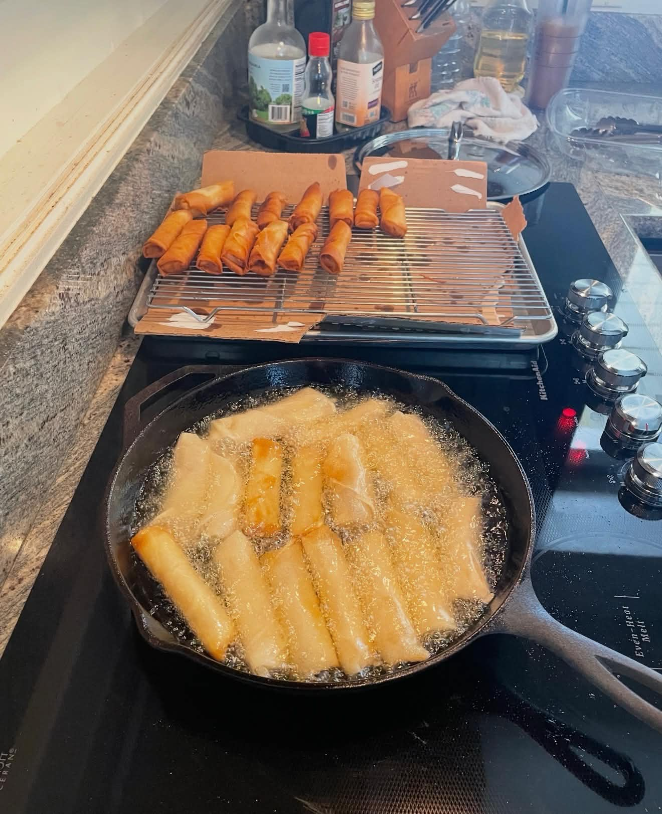

<RecipeCard>

## Photos

*Tangy Runyan Eggroll*

## Ingredients
- 1 package bean thread noodles
- 1 lb ground pork
- 2 tbsp dark soy sauce
- 2-3 stalks green onion/leek, finely chopped
- 1 cup wood ear mushroom, rehydrated and chopped
- 1 tbsp fish sauce
- 1 medium carrot, finely diced
- 1 tbsp ginger, minced
- 3 cloves garlic, minced
- 1 egg (plus one extra for sealing wrappers)
- 1 package lumpia wrappers
- Oil for frying

## Instructions
1. Soak the **bean thread noodles** in hot water until soft, then chop into small pieces.
2. In a large mixing bowl, combine the **ground pork**, **noodles**, **soy sauce**, **green onion**, **wood ear mushroom**, **fish sauce**, **carrot**, **ginger**, **garlic**, and **egg**.
3. Mix thoroughly until well combined.
4. Test the seasoning by microwaving a small amount on a paper towel and tasting.
5. Place about 1/2 to 1 tablespoon of filling on each **wrapper**.
6. Fold and roll tightly, sealing the edges with water or beaten egg.
7. Deep fry at 350°F (175°C) until golden brown.
8. Drain on paper towels and serve hot.
It's most efficient to prepare all eggrolls at once in an assembly line fashion.
Lay out multiple wrappers, add filling to each, then roll and seal them all together.
They can be frozen on a tray (not touching) then transferred to a freezer bag for later use.
To make wontons instead, use wonton wrappers and fold into triangles or nurse's caps.
Instead of frying, boil in water or broth for 3-4 minutes until the wrapper becomes translucent.
These make excellent additions to soup!

## Notes
### Wrapper Options
- Lumpia wrappers are thinner than traditional eggroll wrappers, but either will work. For wontons, use wonton wrappers instead.

### Bulk Preparation
- It's most efficient to prepare all eggrolls at once in an assembly line fashion. 
        Lay out multiple wrappers, add filling to each, then roll and seal them all together. 
        They can be frozen on a tray (not touching) then transferred to a freezer bag for later use.

### Wonton Variation
- To make wontons instead, use wonton wrappers and fold into triangles or nurse's caps. 
        Instead of frying, boil in water or broth for 3-4 minutes until the wrapper becomes translucent. 
        These make excellent additions to soup!

## References
- Thanks to my sister for providing the recipe!
</RecipeCard>
