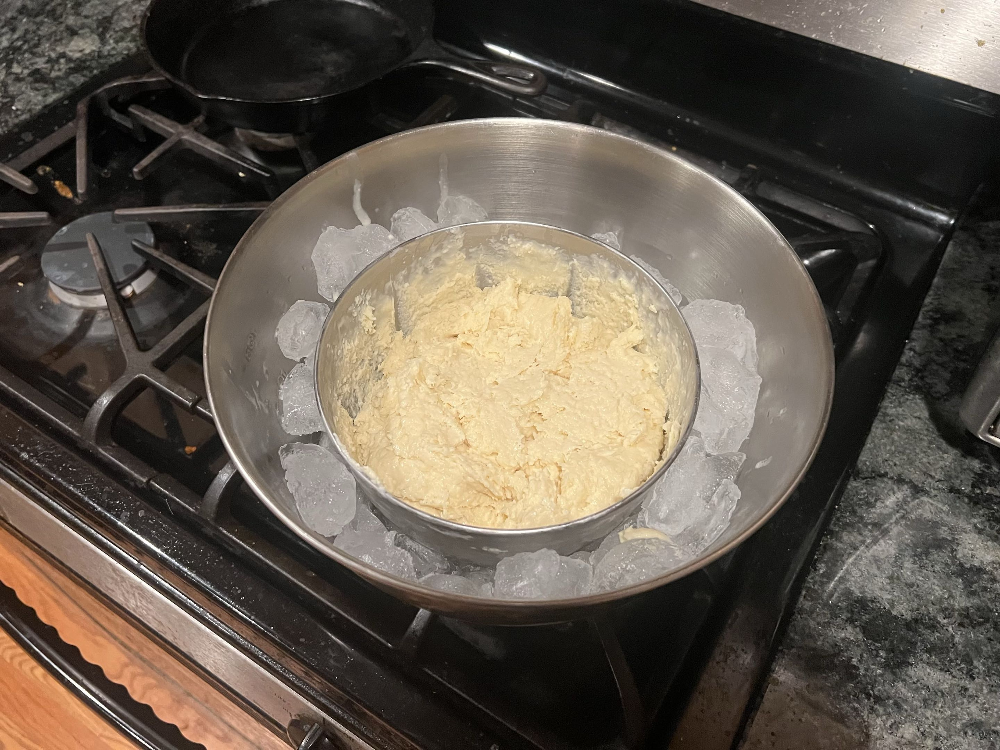

<RecipeCard>

## Photos

*Ice Cream*

## Ingredients
- 2 cups whole milk
- 1 cup heavy cream
- 4 large egg yolks
- 3/4 cup granulated sugar
- 1 tablespoon pure vanilla extract
- salt
- ice 

## Instructions
1. In a saucepan, slowly combine the **whole milk** and **heavy cream**. Heat over medium heat until the mixture is hot, but not boiling, for about 5-7 minutes.
2. In a separate bowl, whisk the egg yolks and granulated sugar together. Mix until it becomes pale and thick, to create a rich custard base. 
3. Temper the egg yolks by slowly pouring about half the **hot milk mixture** into the **egg yolks** while constantly whisking.
4. Combine everything back into the saucepan with the remainder of the **hot milk mixture**. 
5. Cook over medium-low heat, stirring constantly with a spoon. It is finished after about 5-8 minutes when it thickens and coats the back of a spoon. Do not let it boil.
6. Remove from the heat, and stir in the **vanilla extract** along with a pinch of **salt**.
7. Optionally, strain into a clean bowl. 
8. Cool the custard to room temperature, then cover it with plastic wrap over the surface of the custard. Refrigerate for at least 30 minutes or until cool.
9. If you don't have an ice cream maker, fill a bowl halfway with ice, and a generous amount of salt. Mix the ice together. Find a smaller metal bowl to set inside. 
10. Whisk the custard mixture vigorously, and then cover and let sit in the freezer for 30 minutes. Repeat this process around 4 times or until the desired consistency is achieved.
11. When done the consistency should be a very loose soft serve. Let it sit in the freezer for 4 hours or overnight, then enjoy.

## Notes
### Covering
When covering the custard, make sure the plastic wrap touches the surface or the air contact will dry out the top layer of the custard, making it lumpy when mixed. This is less important after it has cooled to room temperature.

## References
- Reference Recipes **[HERE](https://sweetfromscratch.com/easy-homemade-custard-ice-cream-recipe/)** and **[HERE](https://www.youtube.com/watch?v=MdirPsiHnCA)**.

</RecipeCard>
