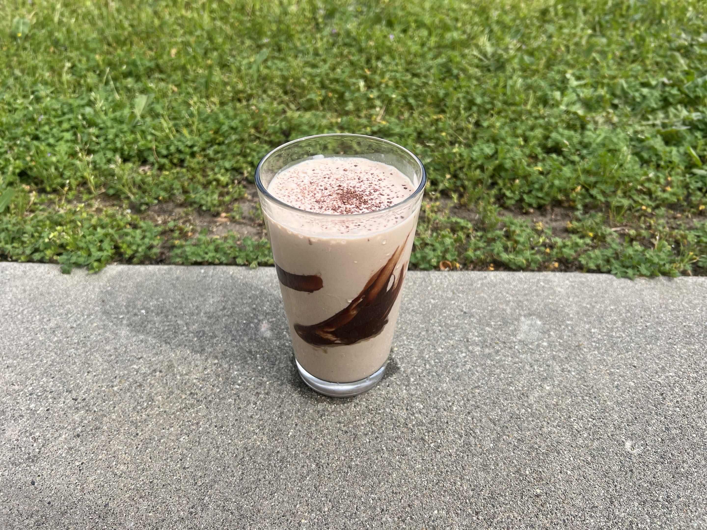

<RecipeCard>

## Photos

*Banana-Chocolate Smoothie*

## Ingredients
- 1 cup vanilla greek yogurt
- 1 banana
- 1/8 cup cream / whole milk
- 1 tsp chocolate powder

## Instructions
1. Put all ingredients into a blender and blend until smooth.
2. Enjoy!

## Notes
### Yogurt Choice
- Greek yogurt is healthier and becomes less waterier over time.

</RecipeCard>
