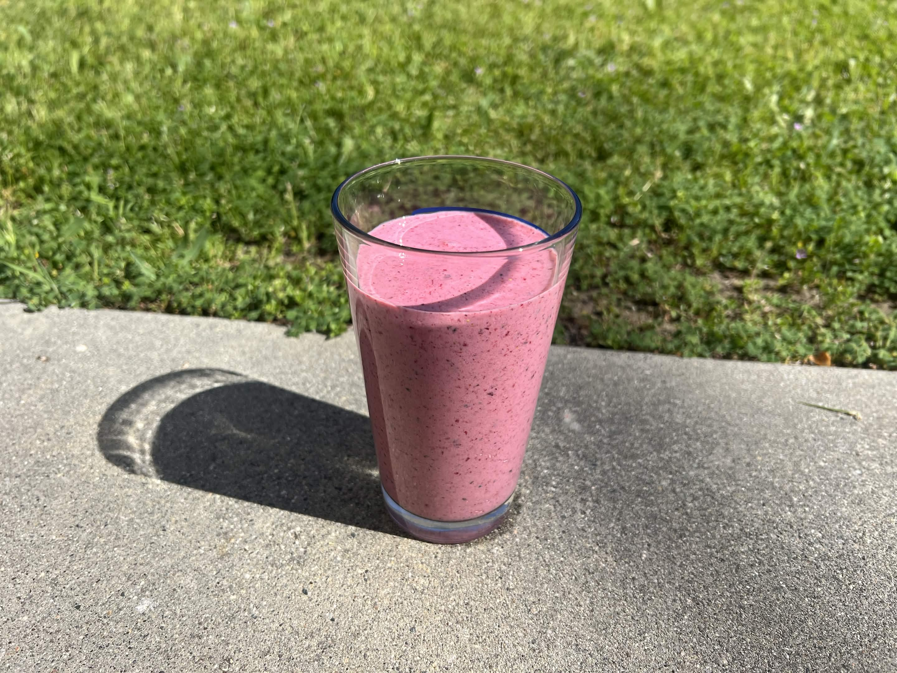

<RecipeCard>

## Photos

*Strawberry Smoothie*

## Ingredients
- 1 cup honey vanilla greek yogurt
- 1 banana
- 1/4 cup frozen berry mix
- 2 cups fresh strawberries

## Instructions
1. Put all ingredients into a blender and blend until smooth.
2. Enjoy!

## Notes
### Yogurt Choice
- Greek yogurt is healthier and becomes less waterier over time.

</RecipeCard>
