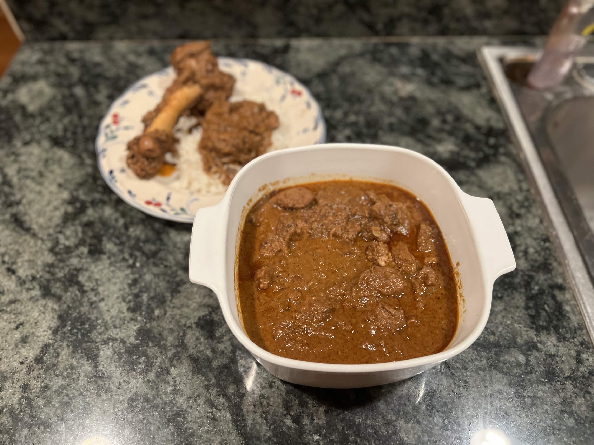

<RecipeCard>

## Photos

*Lamb Vindaloo*

## Ingredients
- 1.25 lbs (500-600g) boneless lamb shoulder or leg
- 20 dried and deseeded Kashmiri red chilies or 1 tablespoon Kashmiri chili powder
- 1/4 cup vinegar
- 1/4 cup water
- 2 tablespoons coriander seeds or ground coriander
- 1 teaspoon cumin seeds or powder
- 10 black peppercorns or 1 teaspoon ground pepper
- 6 whole cloves
- 2-3 inch cinnamon stick or 1 teaspoon ground cinnamon
- 1/4 teaspoon turmeric
- 1/2 teaspoon salt
- 2 tablespoons ginger garlic paste
- 1 tablespoon ghee
- 1 large onion, finely chopped
- 1 1/2 to 2 cups hot water, as needed
- 2 teaspoons jaggery or brown sugar
- Salt, to taste
- 1/2 teaspoon mustard seeds (optional)
- 1 sprig fresh curry leaves (optional)

## Instructions
1. Deseed the **Kashmiri chilies** and soak them in the **vinegar** and 1/4 cup **water** for 15-20 minutes until softened. Skip this step if using chili powder.
2. Combine the **coriander**, **cumin**, **peppercorns**, **cloves**, **cinnamon**, and **mustard seeds** and grind to a fine powder if using whole spices. Keep the **turmeric** separate to avoid staining the grinder.
3. Transfer the ground spices to a blender along with the soaked **chilies and their liquid**, **turmeric**, **salt**, **jaggery**, **garlic**, and **ginger**. Blend into a smooth paste, adding a splash more water if needed. Use an immersion blender to get a smoother final result.
4. Rub the paste thoroughly into the **lamb**, coating every piece. Cover and refrigerate for at least 4-6 hours, ideally overnight.
5. Heat the **oil** in a Dutch oven or heavy-bottomed pan over medium heat. Add the **onion** and sauté 4-5 minutes until golden.
6. Add the marinated **lamb** with all of its paste. Sauté over medium-high heat for 5-6 minutes, then cover and cook on medium-low for 3-4 minutes.
7. Stir in the **curry leaves** (if using) and sauté 2 minutes.
8. Pour in 1 cup of hot **water** and stir well. Cover and simmer on medium-low heat, stirring every 10-15 minutes to prevent sticking. Add more hot water in 1/2 cup batches as needed.
9. Cook until the lamb is fork-tender, about 1 hour 15-30 minutes depending on the cut. Boneless leg may take closer to 90 minutes.
10. Once tender, uncover and reduce the sauce to a thick, clingy consistency. Taste and adjust with additional **salt** and **jaggery** — the dish should balance hot, sour, and slightly sweet.
11. Rest 10 minutes before serving — the sauce thickens as it cools.

## Notes
### Tips
- **Make ahead**: Vindaloo always tastes better the next day. Make it a day in advance and reheat gently with a splash of water.
- **Vinegar matters**: Traditional Goan vindaloo uses palm vinegar (toddy vinegar). Cane, apple cider, or rice vinegar are acceptable substitutes; avoid white distilled.
- **It's Not Vindaloo if it's Not Spicy**: My friends say it's so - you better be coughing!

## References
- Reference Recipe **[HERE](https://www.indianhealthyrecipes.com/lamb-vindaloo/)**
</RecipeCard>
