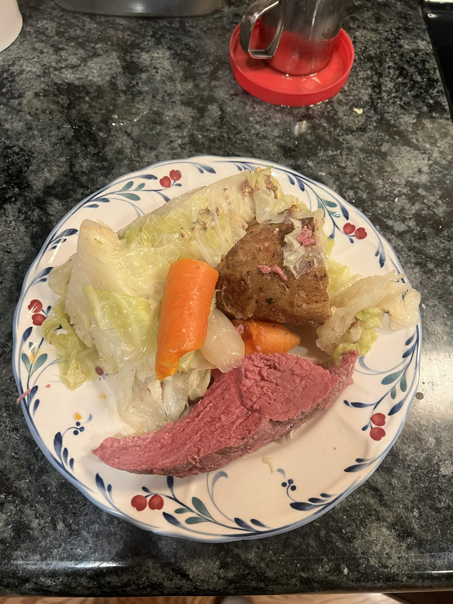

<RecipeCard>

## Photos

*Corned Beef and Cabbage*

## Ingredients
- 2 lbs red potatoes, quartered
- 1 lb carrots, cut into 3-inch pieces
- 2 celery ribs, cut into 3-inch pieces
- 1 small onion, quartered
- 1 corned beef brisket with spice packet (3 to 3½ lbs)
- 8 whole cloves
- 6 whole peppercorns
- 1 bay leaf
- 1 bottle (12 oz) Guinness stout or reduced-sodium beef broth
- ½ small head cabbage, thinly sliced
- Prepared horseradish, for serving

## Instructions
1. Add **potatoes**, **carrots**, **celery**, and **onion** to a 6-qt slow cooker. Place the **corned beef brisket** on top (discard or save the spice packet).
2. Place **cloves**, **peppercorns**, and **bay leaf** on a piece of cheesecloth. Gather the corners and tie with string to make a sachet. Add to the slow cooker.
3. Pour the **Guinness** over everything.
4. Cook covered on low for 8-10 hours, until the meat and vegetables are tender. Add the **cabbage** during the final hour.
5. Remove and discard the spice sachet. Slice the beef diagonally across the grain into thin pieces.
6. Serve with the vegetables and **horseradish** on the side.

## Notes
### Sweetness
- Use brown sugar or honey with the beef to add complexity to the finished flavor.

### Slicing the Beef
- Always slice corned beef against the grain or it will be tough and stringy.

## References
- Reference Recipe **[HERE](https://www.tasteofhome.com/recipes/guinness-corned-beef-and-cabbage/)**
</RecipeCard>
