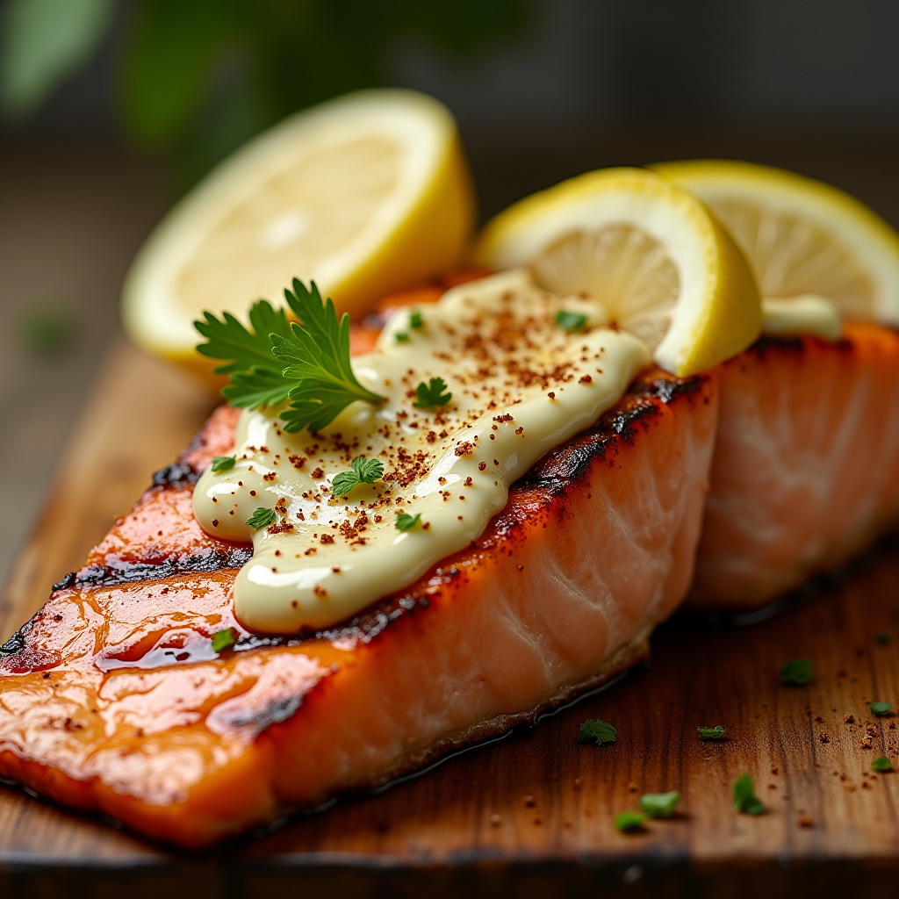

# Grilled Lemon Pepper Salmon

Super simple! This recipe entry is more or less just a formality.

## Photos

*Super simple! This recipe entry is more or less just a formality.*

## Ingredients

- 1 Salmon fillet
- 2 tbsp mayonnaise
- 1 tbsp lemon pepper seasoning (to taste)
- Freshly ground pepper (to taste)
- 1 lemon (to taste)

## Instructions

1. Find a metal grill tray, or grill basket.
2. Place salmon skin-side down in the grill tray/basket.
3. Mix **mayonnaise** and **lemon pepper seasoning** in a bowl to taste.
4. Spread the **mayo mixture** over the salmon fillets in the grill tray/basket.
5. On a grill preheated to 400/500F, grill salmon checking frequently until internal temperature reads 145F on an instant read thermometer. Alternatively, check the thickest portion of the fillet with a fork. If flaky, salmon is done.
6. Serve with rice, and top with pepper and the juice of a lemon for best results.

## Notes

### More Lemon Pepper
- Use a good amount of lemon pepper, but be careful of making it too lemony. Extra pepper is usually fine.

## References

- Idk talk to my mom...
