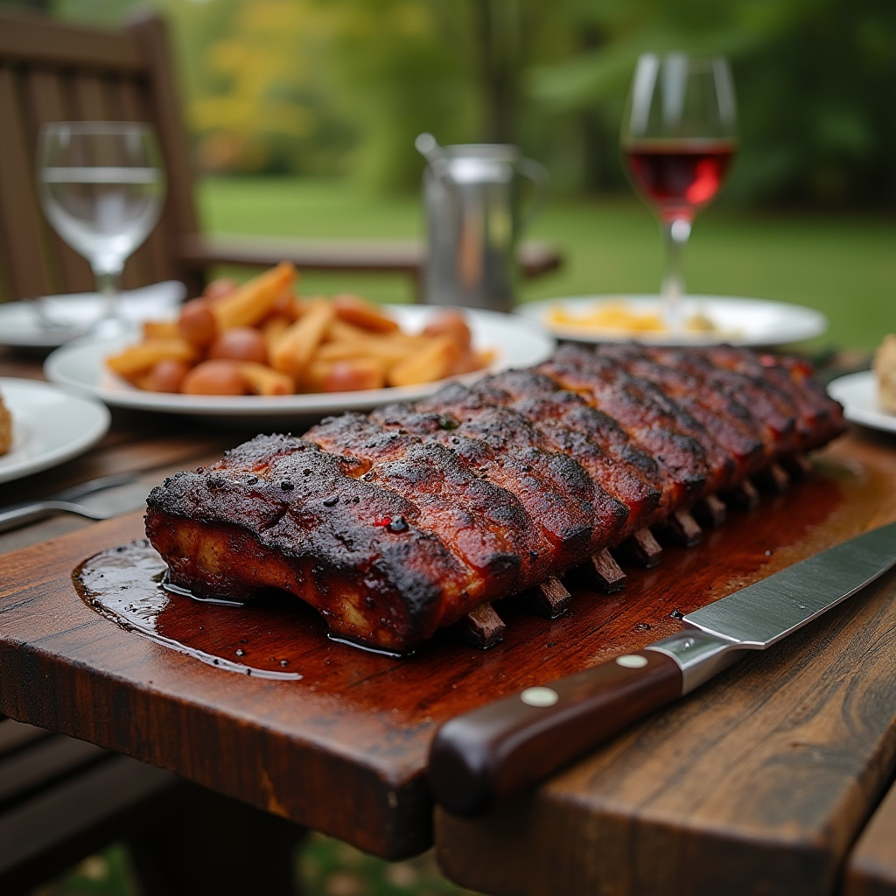

# Instant Pot Ribs

Juicy and smoky slow-cooked ribs for your grill to bless you with.

## Photos

*Juicy and smoky slow-cooked ribs for your grill to bless you with.*

## Ingredients

### Ribs
- 1 rack baby back ribs or spare ribs (about 1 1/2 to 2 pounds)
- 1 cup water
- 3 tablespoons apple cider vinegar
- 1/2 teaspoon liquid smoke
- 1/4 cup barbecue sauce, plus extra for serving
### Rub
- 2 tablespoons brown sugar
- 1 tablespoon paprika
- 1 teaspoon ground black pepper
- 1 teaspoon kosher salt
- 1 teaspoon chili powder
- 1 teaspoon garlic powder
- 1 teaspoon onion powder
- 1/4 teaspoon cayenne pepper

## Instructions

1. Rinse the ribs and pat them dry. If your ribs still have the thin, shiny membrane on the back, remove it.
2. In a small bowl, stir together the **brown sugar**, **paprika**, **black pepper**, **salt**, **chili powder**, **garlic powder**, **onion powder**, and **cayenne**.
3. Rub it all over the ribs, generously coating all of the sides.
4. Place the trivet in the Instant Pot. Pour in the **water**, **apple cider vinegar**, and **liquid smoke**.
5. Place the ribs inside the pot, standing them on the trivet on their side and wrapping the rack around the inside of the pot like a circle.
6. Cover and seal the Instant Pot. Cook on high pressure for 23 minutes (baby back ribs) or 35 minutes (spare ribs).
7. While starting step 8, place a rack in the upper third of the oven and set it to broil.
8. After the ribs finish, allow the pressure to release naturally for 5 minutes, then vent to release all of the remaining pressure.
9. Line a large baking sheet with aluminum foil. Transfer the cooked ribs to the foil, then brush liberally with **barbecue sauce**.
10. Place under the broiler just until the sauce begins to caramelize, about 2 minutes.

## Notes

### Homemade is Best
- Always worth it to make your own barbecue sauce & rub!

## References

- https://www.wellplated.com/instant-pot-ribs/
