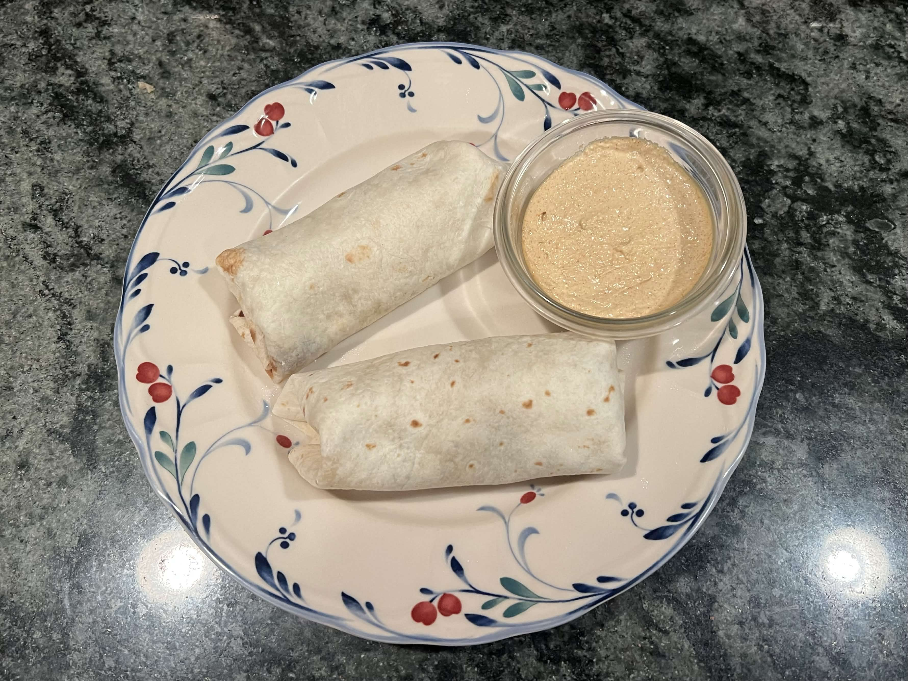

<RecipeCard>

## Photos

*Creamy Jalapeno Sauce*

## Ingredients
- 1 12oz jar of pickled jalapeno slices (will not use the whole thing)
- 1 teaspoon paprika
- 1/2 teaspoon ground cumin
- 1 teaspoon garlic powder 
- 1 teaspoon onion powder 
- 1 teaspoon chili powder 
- 1 teaspoon salt 
- 1/4 teaspoon cayenne pepper, or more for a spicier sauce
- 1/2 cup mayonnaise
- 1/2 cup sour cream

## Instructions
1. Add the **pickled jalapeno slices** along with some of the liquid to a blender. Blend until completely smooth. It should be smooth and not chunky.
2. In a mixing bowl, combine the **mayonnaise**, **sour cream**, **paprika**, **cumin**, **garlic powder**, **onion powder**, **chili powder**, **cayenne powder**, and **salt**. Stir until smooth and combined.
3. Add 3-7 tablespoons of the blended jalapeno puree to the bowl and mix it in. Add more to taste/consistency.
4. Move to an airtight container and wait at least an hour for the flavors to develop. It will get more pungent the longer you leave it. Will keep for around a week in the fridge.

## Notes
### Ingredient Sourcing
- Mt Olive sells both normal and sweet jalapeno slices, you can make your choice. I used the normal ones.

## References
- Reference Recipe **[HERE](https://www.youtube.com/watch?v=-q95xwVy94Y)**
</RecipeCard>
