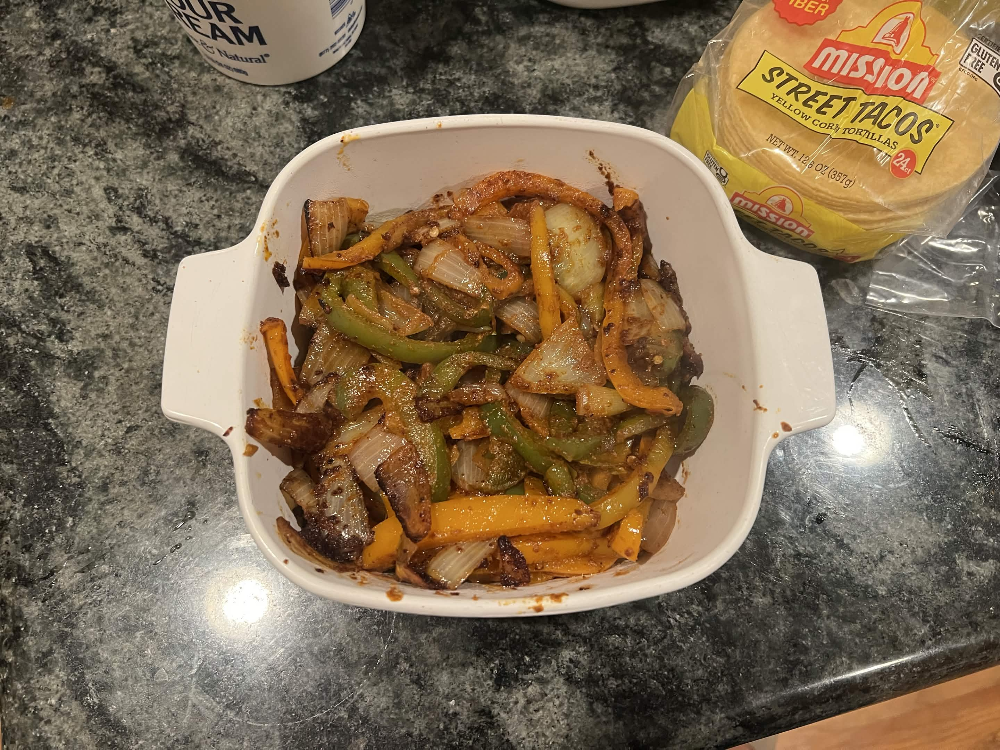

<RecipeCard>

## Photos

Fajita Vegetables

## Ingredients
- 1 medium onion, sliced into slivers
- 3 bell peppers (mix of red, yellow, green, or orange), sliced into strips
- 3 tablespoon olive oil
- Juice of 1/2 lime, plus extra for serving
- 1 teaspoon chili powder
- 1/2 teaspoon smoked paprika
- 1/2 teaspoon onion powder
- 1/2 teaspoon black pepper
- 1/2 teaspoon cumin
- 3/4 teaspoon salt

## Instructions
1. Slice the **onion** into slivers and the **bell peppers** into thin strips.
2. In a small bowl, whisk together 1 tablespoon **olive oil**, **lime juice**, **chili powder**, **smoked paprika**, **onion powder**, **black pepper**, **cumin**, and 1/2 teaspoon **salt**.
3. Toss the sliced **peppers** and **onions** with the seasoning mixture until evenly coated.
4. Heat 2 tablespoons **olive oil** in a large skillet over medium-high heat until shimmering.
5. Add the **onions** first and cook 2 minutes until they begin to soften.
6. Add the **peppers** along with the remaining 1/4 teaspoon **salt**. Cook 3-4 minutes, stirring occasionally, until the vegetables are tender-crisp with some char on the edges.
7. Squeeze additional **lime juice** over the top and serve hot.

## Notes
### Tips
- **Tender-crisp is the goal**: don't overcook — the peppers should still have a bite.
- **Hot pan, hot oil**: a ripping-hot skillet gives the char marks that make fajitas taste like fajitas.

## References
- Adapted from **[Spend With Pennies - Easy Chicken Fajitas](https://www.spendwithpennies.com/easy-chicken-fajitas/)**
</RecipeCard>
