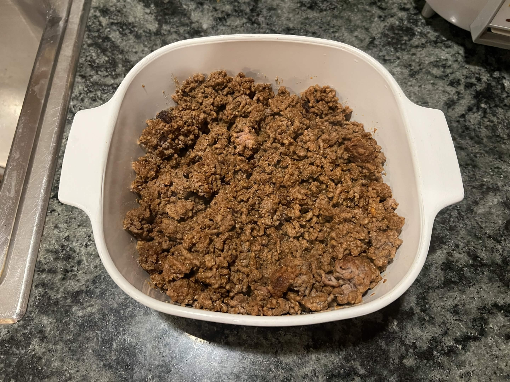
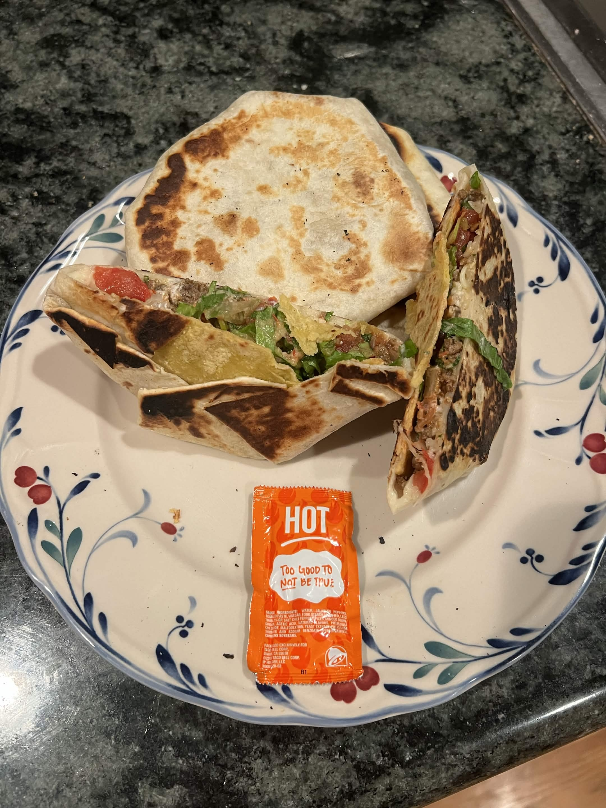

<RecipeCard>

## Photos

*Taco Bell Meat*

*Homemade Crunchwraps*

## Ingredients
- 2 lbs ground beef
- 2 2/3 cups water or beef broth, divided
- 5 tablespoons taco seasoning
- 2 tablespoons cornstarch
- 1 teaspoon unsweetened dark cocoa powder (optional, for color)
- Salt, to taste

## Instructions
1. In a large bowl, combine the **ground beef**, 1 2/3 cups **water**, **taco seasoning**, **cornstarch**, and **cocoa powder**. Mix by hand or with a hand mixer until it forms a thick, sticky batter-like consistency.
2. Grease a large nonstick skillet or Dutch oven and add the meat mixture along with the remaining 2/3 cup **water**.
3. Cover and cook over medium-high heat for 5 minutes.
4. Uncover and break the meat apart fully with a spatula. Reduce heat to low and simmer 20-30 minutes, stirring occasionally, until the liquid has mostly evaporated and the mixture is thick and saucy.
5. Taste and adjust with **salt** as needed.

## Notes
### Meat Quality 
Slightly fatty meat helps the cornstarch slurry thicken the meat.

## References
- Reference Recipe **[HERE](https://www.favfamilyrecipes.com/taco-bell-meat/)**
</RecipeCard>
