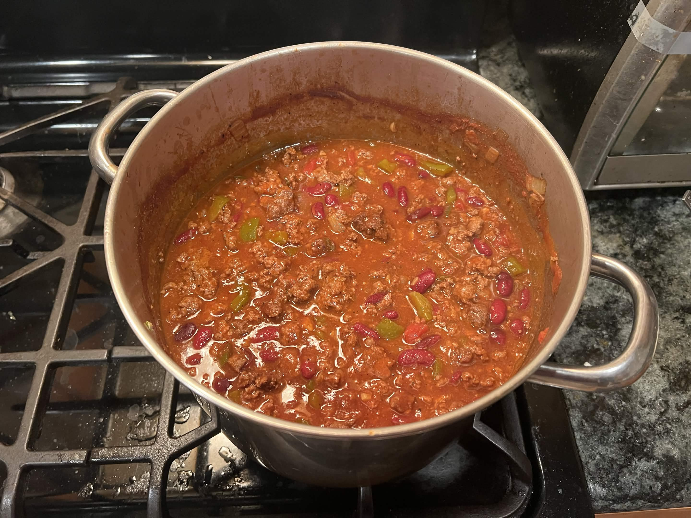

<RecipeCard>

## Photos

*Chili*

## Ingredients
- 2 lbs lean ground beef
- 1 medium onion, diced
- 1 jalapeño, seeded and finely diced
- 1 green bell pepper, seeded and diced
- 4 cloves garlic, minced
- 2 1/2 tablespoons chili powder, divided
- 1 teaspoon ground cumin
- 1 can (14.5 oz) crushed tomatoes
- 1 can (14.5 oz) diced tomatoes, with juices
- 1 can (19 oz) red kidney beans, drained and rinsed
- 1 1/2 cups beef broth
- 1 cup beer
- 1 tablespoon tomato paste
- 1 tablespoon brown sugar (optional)
- Salt and black pepper, to taste

## Instructions
1. Combine **ground beef** with 1 1/2 tablespoons of the **chili powder** and mix well.
2. In a large pot over medium-high heat, brown the seasoned **ground beef** with the **onion**, **jalapeño**, **bell pepper**, and **garlic**. Break up the meat as it cooks. Drain any excess fat.
3. Add the remaining **chili powder**, **cumin**, **crushed tomatoes**, **diced tomatoes**, **kidney beans**, **beef broth**, **beer**, **tomato paste**, and **brown sugar**. Stir to combine.
4. Bring to a boil, then reduce heat and simmer uncovered for 45-60 minutes, stirring occasionally, until the chili has thickened to your liking.
5. Season with **salt** and **pepper** to taste. Serve topped with cheddar cheese, sour cream, green onions, or cilantro.

## Notes
### Tips
- Adding the first portion of chili powder directly to the raw beef helps bloom the spice in the fat as it browns, building a deeper flavor base.
- The beer adds richness — a lager or amber ale works well. Substitute with more beef broth if preferred.
- Simmering uncovered is key for thickening. If you want it thicker faster, mash a few beans against the side of the pot.

### Toppings
- Shredded cheddar, sour cream, green onions, cilantro, sliced jalapeños, and hot sauce all work great.

## References
- Reference Recipe **[HERE](https://www.spendwithpennies.com/the-best-chili-recipe/)**
</RecipeCard>
